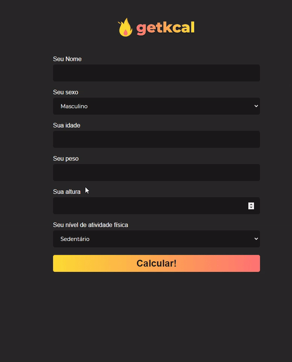

<h1 align="center">
 
</h1>
<h1 align="center">
    
</h1>

## 🔖 Sobre
    O projeto calcula o GEB (gasto energético basal), utilizando como base a fórmula de Harris - Benedict.
    Trazendo como resposta o metabolismo basal, a média para manter o peso, a média para perder peso e a média para ganhar peso.

